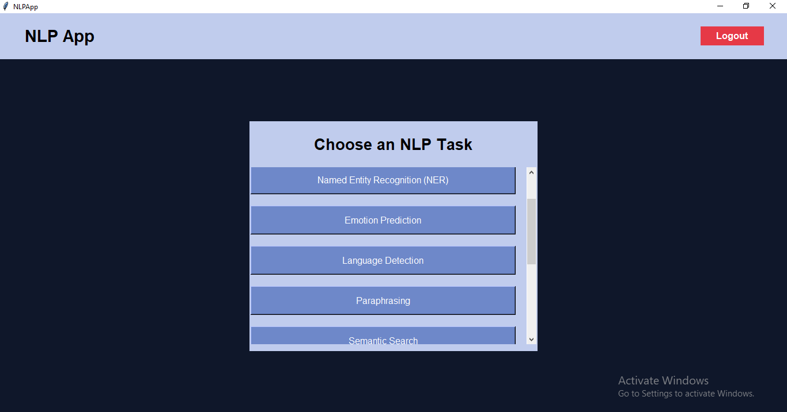

# NLP App
A complete NLP (Natural Language Processing) desktop application built with Python and Tkinter. Features include sentiment analysis, language detection, paraphrasing, and question answering etc.
## Features
- Sentiment Analysis of text
- Named Entity Recognition
- Emotion Detection
- Language Detection
- Paraphrasing Text
- Semantic Search
- Semantic Similarity
- Summarize the text
- Translate the text
- Question Answering
- Interactive GUI with Tkinter
## Technology Stack
- Python 3.x
- Tkinter (GUI)
- NLP libraries: spaCy, NLTK, transformers
- APIs for language processing
## Demo

*Main GUI of the NLP App for choosing any NLP task*
## How to Run the App
Follow these steps to run the NLP App on your system:

1. **Clone this repository**
```bash
git clone https://github.com/AryaShukla123/NLP-App.git
```

2. **Navigate to the project folder**
```bash
cd NLP-App
```

3. **Install required dependencies**
```bash
pip install -r requirements.txt
```

4. **Run the application**
```bash
python app.py
```


